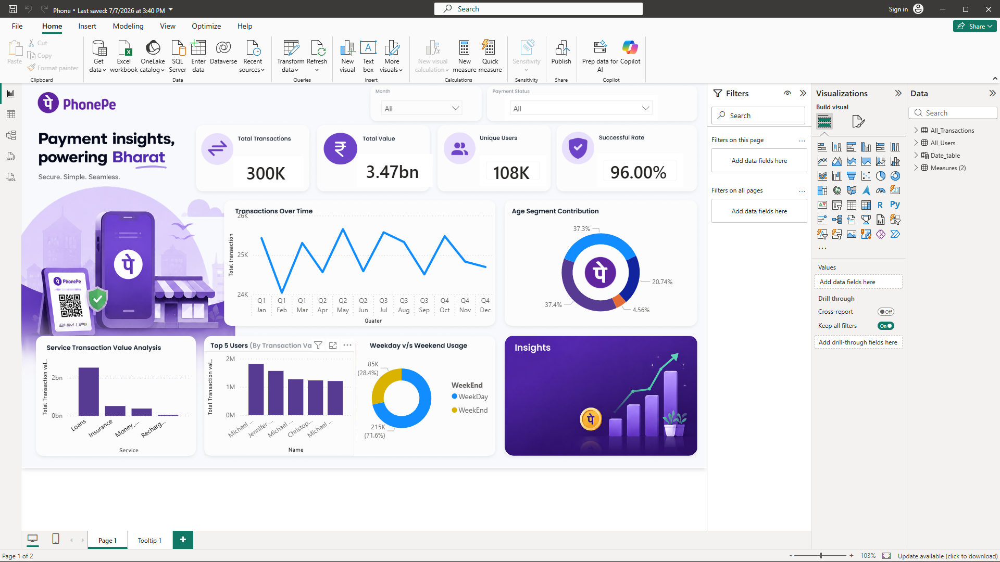

# PhonePe Digital Transactions Analysis 📊

An interactive Power BI dashboard analyzing digital payment transaction patterns, user demographics, and platform reliability metrics for a UPI-based payments platform.

## 📌 Overview

This project analyzes **300,000+ transactions** from **107,658 users** across a digital payments platform, uncovering insights into transaction success rates, service-wise revenue distribution, user demographics, and month-over-month growth trends.

## 🎯 Business Objective

Digital payment platforms need continuous visibility into transaction health and user behavior to reduce failures, identify high-value service segments, and track growth. This dashboard answers:
- What is the platform's transaction success rate, and where do failures occur?
- Which services (Money Transfer, Recharge & Bills, Loans, Insurance) drive the most volume and value?
- How is transaction volume and value trending month-over-month?
- Which user age groups are most active on the platform?

## 📂 Dataset

| Table | Records | Description |
|---|---|---|
| `All_Transactions` | 300,000 | Transaction ID, Amount, User ID, Service, Service Type, Payment Status, Date |
| `All_Users` | 107,658 | User ID, Name, Age, Join Date, Age Group |
| `Date_table` | 365 days | Calendar table for time intelligence |

**Services covered:** Money Transfer, Recharge & Bills, Loans, Insurance (16 sub-service types including UPI transfer, Mobile Recharge, FASTag, Bike/Gold Loan, Mutual Fund, Term Life, etc.)

**Payment outcomes tracked:** Successful, Failed, Wrong PIN, Server Error, Insufficient Amount

## 🛠️ Tools & Techniques

- **Power BI Desktop** — data modeling, report design
- **Power Query (M)** — data import and transformation from source Excel files
- **DAX** — 9 custom measures for KPIs and time intelligence
- **Data Modeling** — star schema with Date, Users, and Transactions tables

## 📐 Key DAX Measures

```dax
Total Transaction value = SUM(All_Transactions[Amount])

Total transaction = COUNT(All_Transactions[Transaction_ID])

Succesfull Transaction =
    CALCULATE([Total transaction], All_Transactions[Payment_Status] = "Successful")

Success Rate = DIVIDE([Succesfull Transaction], [Total transaction])

Total Users = DISTINCTCOUNT(All_Users[User_ID])

Trans Value PM =
    CALCULATE([Total Transaction value], DATEADD(Date_table[Date], -1, MONTH))

Total Value MOM% =
    DIVIDE([Total Transaction value] - [Trans Value PM], [Trans Value PM], 0)

Total Trans PM =
    CALCULATE([Total transaction], DATEADD(Date_table[Date], -1, MONTH))

Total Trans MOM% =
    DIVIDE([Total transaction] - [Total Trans PM], [Total Trans PM], 0)
```

## 🖼️ Dashboard Preview



*Add your screenshot(s) to an `images/` folder in this repo and update the path above. To capture: open `Phone.pbix` in Power BI Desktop → File → Export → Export to PDF/Image, or simply take a screenshot of the report canvas.*

## 📊 Dashboard Features

- **KPI Cards:** Total Transactions, Total Transaction Value, Total Users, Success Rate
- **Line Chart:** Transaction trend by Month/Quarter
- **Column Charts:** Transaction value by Service and by Service Type (tooltip drill-through)
- **Donut Charts:** User distribution by Age Group; Weekly transaction trend
- **Top Users Chart:** Ranked by transaction value
- **Slicers:** Month, Payment Status — for interactive filtering

## 🔍 Key Insights

- **96% overall success rate** across 300,000 transactions; failures concentrated in Wrong PIN, Server Error, and Insufficient Amount categories — highlighting specific friction points in the payment flow.
- **Money Transfer is the highest-volume service** (150,000 transactions — 50% of all activity), followed by Recharge & Bills, Loans, and Insurance (50,000 each).
- **Gen X and Millennials are the platform's core user base**, together accounting for ~80,000 of the 107,658 total users, with Gen Z as a fast-growing segment.
- Month-over-Month DAX measures enable continuous tracking of both transaction volume and value growth, supporting proactive business decisions.

## 📎 How to Use

1. Clone this repo
2. Open `Phone.pbix` in Power BI Desktop
3. Explore interactive filters, slicers, and drill-through tooltips

## 👤 Author

**Mayank Srivastava**
[LinkedIn](https://linkedin.com/in/your-linkedin) · [GitHub](https://github.com/Corvus06655)
